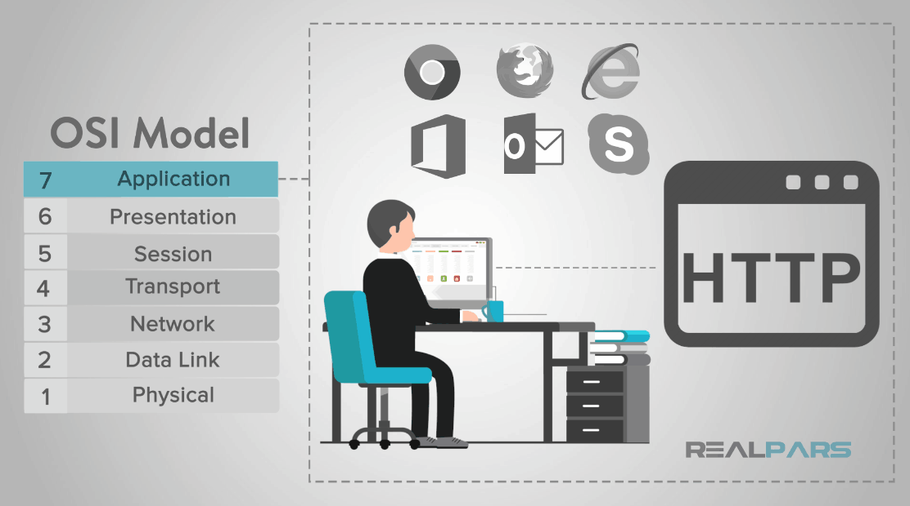
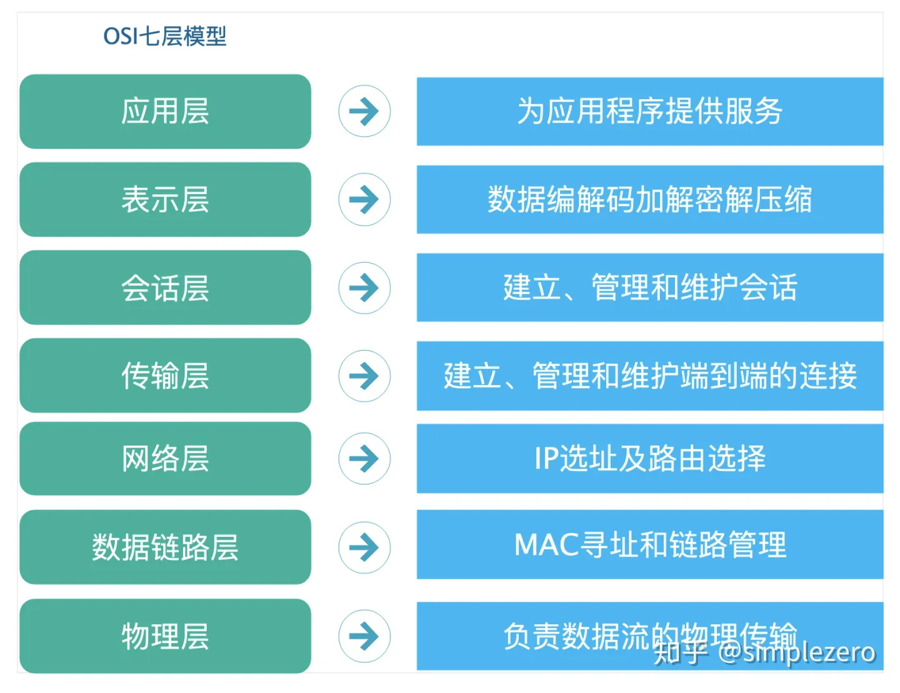

# OSI 网络模型

Open System Interconnection Model, 开放式系统互联模型(OSI)是一种概念模型，由国际标准化组织提出，一个试图使各种计算机在世界范围内互连为网络的标准框架。定义于ISO/IEC 7498-1。

我们都知道，世界上第一台计算机诞生于1946年的美国，之后，1969年才有了计算机网络。之后，由于计算机技术的飞速发展，计算机网络也不断地推成出新，于是，不同的计算机网络使用了不同的标准进行通信，从而无法互联。为了统计网络标准，让不同的计算机网络实现互联，ISO（国际标准化组织）组织在1985年研究的网络互连模型。ISO为了更好的使网络应用更为普及，推出了OSI参考模型。其含义就是推荐所有公司使用这个规范来控制网络。这样所有公司都有相同的规范，就能互联了。

## OSI七层模型

OSI模型采用分层的思想来实现了网络基础架构，分层的好处是，将复杂的流程进行了分解，极大的简化了问题，这样就更加容易发现和解决针对性问题。

OSI模型将网络分为7层，从下到上依次是：物理层、数据链路层、网络层、传输层、会话层、表示层和应用层。

下面我们将依次来看看各层的价值和作用！

### 应用层

顾名思义，这一层最终负责支持用户程序使用的服务。应用程序包括安装在操作系统中的软件程序，比如微信，World，浏览器等，改层定义的是应用进程间通讯和交互的规则，不同的应用有着不同的应用层协议。

这一层中运行的协议包括文件传输协议（FTP，File Transfer Protocol）、安全壳协议（SSH，Secure Shell）、简单邮件传输协议（SMTP，Simple Mail Transfer Protocol）、因特网消息访问协议（IMAP，Internet Message Access Protocol）、域名服务（DNS，Domain Name Service）和超文本传输协议（HTTP，Hypertext Transfer Protocol）。

虽然这些协议中的每一个都服务于不同的功能，运行的方式也各不相同，但从较高的层次看，它们都促进了信息的交流。

### 表示层

改层主要负责数据的格式，比如字符编码与转换，以及数据加密。

托管用户应用程序的操作系统通常包含第六层中的程序，这个功能并不总是被网络协议实现。

第六层确保第七层中的用户程序可以成功地消费数据，当然还有最终数据的展示。

SSL 或 TLS 加密协议位于第六层。这些加密协议为网络上的节点提供身份认证和数据加密功能，帮助确保传输的数据抵御恶意用户的攻击。TLS 是 SSL 继任者。

### 会话层

该层负责建立、维持和终止会话。

会话建立在两个网络应用之间，是双方商定好的连接。所以会话是一个建立在两个特定的用户应用之间的连接，其中有一些重要的概念需要考虑：

* 客户端与服务器模型：请求信息的应用被称为客户端，拥有被请求信息的应用被称为服务器。
* 请求与响应模型：在建立会话的过程和会话期间，不断有来回的信息请求，还有包含被请求信息的响应或者是“嘿，我没有你要的东西”。

会话持续的时间可以非常短，也可以非常长，有时会话也可能会失败。

根据所采用的协议，会话可能会启动各种故障解决程序。根据所使用的应用程序/协议/硬件，会话可能支持单工，半双工或全双工模式。

### 传输层

这一层也负责数据包的分段，或者说数据包如何被拆分成小片并发往整个网络。

不像上一层，第四层也理解整个消息，而不只是每个独立的数据包的内容。根据对整个消息的理解，第四层不再一次性发送所有数据包，从而管理网络拥塞。

第四层中最有名的两个协议是传输控制协议（TCP，Transmission Control Protocol）和用户数据报协议（UDP，User Datagram Protocol）。

* TCP： 是一个面向连接的协议，优先保证的是数据的质量而不是速度。
* UDP： 是一个无连接的协议，优先保证速度而不是数据的质量。UDP 不要求进行握手，这也正是它被称为无连接的原因。

TCP 和 UDP 都将数据发往网络设备上的特定端口，这些网络设备都有自己的 IP 地址。IP 地址和端口号的组合被称为套接字（socket）。

### 网络层

就是在这里，我们通过路由器在网络间或跨网发送信息。不仅仅是节点到节点的通信，我们现在还可以进行网络到网络的通信了。

路由器是第三层的主力——它们是在第三层中必不可少。路由器跨越多个网络移动数据包。

路由器不仅通过连接到网络服务提供商（ISPs，Internet Service Providers）提供因特网访问，还跟踪着所在网络中的一切（记住交换机跟踪的是一个网络中所有的 MAC 地址），它所连接的其它网络，以及在这些网络中路由数据包的不同路径。

第三层上的传输是无连接的、尽力而为的——除了将流量发往它应该去的地方，它们不会做任何事。更多与数据传输有关的协议在第四层。

IP 地址通过地址解析协议（ARP，Address Resolution Protocol）与物理节点的 MAC 地址相关联，ARP 用节点对应的 IP 地址解析 MAC 地址。

ARP 通常被认为是第二层的一部分，但是由于 IP 地址在第三层以下都不存在，所以 ARP 也是第三层的一部分。

### 数据链路层

它定义了数据的传输格式、可以在节点间流动的数据量大小、数据流动可以持续的时长，以及在流中检测到错误时应采取的措施。

使用更加正式的技术术语描述如下：

* 线路规划：谁应该交流多久？节点传输信息的时间应该持续多久？
* 流量控制： 应该传输的数据量是多少？
* 错误控制-检测和校正： 从电尖峰脉冲到卑鄙的连接器，所有的数据传输方法都有可能出错。一旦第二层的技术告知网络管理员有关第二层或第一层的问题，系统管理员就能为后续几层纠正那些错误。第二层主要关心的是错误检测，而不是错误校正。

### 物理层

物理层考虑的是如何在各种媒介上传输数据，它定义了与传输媒介相关的接口特性，确保数据可以在各种物理媒介上进行传输，为数据的传输提供可靠的环境。

* 机械特性：指明接口所用的接线器的形状和尺寸、引线数目和排列、固定和锁定装置等。
* 电气特性：指明在接口电缆的各条线上出现的电压的范围。
* 功能特性：指明某条线上出现的某一电平的电压的意义。
* 规程特性：指明对于不同功能的各种可能事件的出现顺序。

