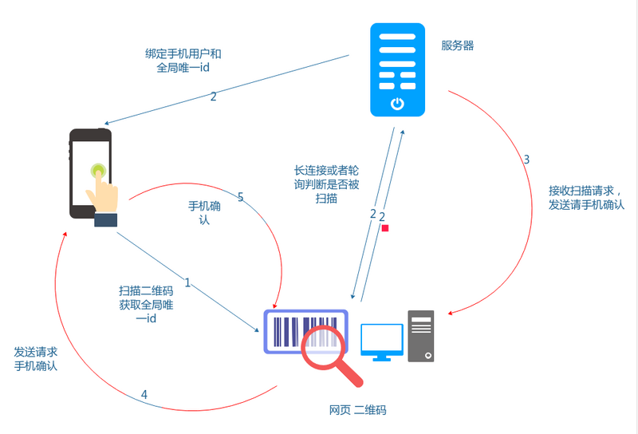
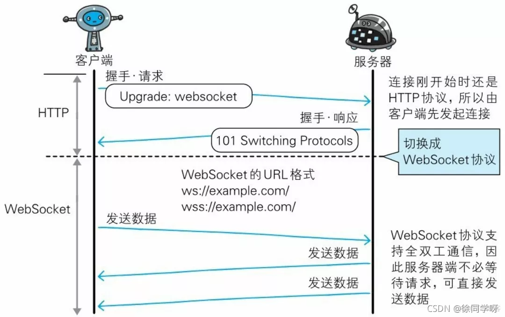

# WebScoket协议

在实际开发中，我们经常有一种需求，就是扫码登陆，或者是扫码支付，需要手机端完成响应的操作之后，服务端通知客户端来完成登陆或者页面通知刷新。

通过前面课程的学习，我们知道HTTP协议是为了B/S架构进行的设计，是浏览器发起请求，服务器被动响应，如果要使用HTTP协议来实现上面的功能，就只能使用定时轮询，也就是每隔一定的时间，去服务端查看是否已经完成了支付或者登陆，进而更新浏览器的页面状态。

然而，这种方式需要客户端不断向服务器发送请求，服务器接收到请求后才会返回数据，因此在客户端和服务器之间会产生大量的HTTP请求和响应，这会导致较大的网络负荷。同时，由于服务器是被动响应请求，因此实时性受限。

所以，更好解决这个问题就需要用到了WebScoket啦！

## WebScoket基本概念

WebSocket是一种在单个TCP连接上进行全双工通信的协议，可以在客户端和服务器之间创建持久性连接，从而允许实时数据传输，具有实时性高、性能好、跨域支持等优点。

WebSocket是一种基于HTTP协议的协议，通过在HTTP握手期间升级协议的方式，使得客户端和服务器之间可以创建持久性的连接，从而允许实时数据传输。

WebSocket是HTML5提出的一种新的客户端与服务器之间通信的技术，其基本原理是客户端通过WebSocket协议与服务器建立长连接，服务器可以随时向客户端推送消息，实现实时双向通信。WebSocket协议采用了类似TCP的握手机制，建立连接后通信双方可以自由地发送消息，无需通过HTTP请求来获取数据。

相比于HTTP轮询，WebSocket具有以下优点：

* 实时性好，能够实现实时双向通信；
* 减少网络负荷，因为客户端与服务器建立的是长连接，不需要频繁地发送HTTP请求和响应；
* 支持跨域，可以在不同的域之间进行通信。

Websocket适用于对实时性要求比较高的应用场景，例如在线游戏、即时通讯、实时数据推送等。

总之，HTTP轮询和WebSocket都可以实现客户端与服务器之间的实时通信，但是WebSocket更适合对实时性要求比较高的应用场景，因为它能够实现实时双向通信，同时减少网络负荷和支持跨域。

## WebScoket的发展历史

它最初由 Google 工程师 Ian Hickson 在 2008 年提出，并被 W3C 所接受，于 2011 年被标准化。最终成为了HTML5标准的一部分。

WebSocket 技术的发展史可以分为以下几个阶段：

* **Hixie-76：** 最初的 WebSocket 协议由 Ian Hickson 提出，称为 Hixie-76。它的设计基于 HTML5 规范，使用 HTTP 协议进行握手，并通过特殊的 Upgrade 头字段将连接升级到 WebSocket 协议。该协议已经过时。
* **HyBi：** 为了推动 WebSocket 协议的标准化进程，IETF（Internet Engineering Task Force）在2010年成立了一组工作组，称为 HyBi（Hyper Text Bidirectional）工作组。该工作组的目标是制定一个更加稳定和安全的 WebSocket 协议标准。HyBi 工作组制定了一系列协议版本，其中比较重要的版本是 HyBi-10 和 HyBi-17。
* **RFC 6455**：HyBi 工作组在 2011 年提交了最终的标准草案，即 RFC（Request for Comments）6455。这个标准成为了现代 WebSocket 协议的基础。RFC 6455 标准规定了 WebSocket 协议的具体实现方式，包括握手过程、数据传输和关闭连接等方面。

目前，WebSocket 协议已经被广泛应用于 Web 开发中，并且得到了各种浏览器的支持。

## 通信流程

**整个通信流程如下：**
1. 客户端发起 HTTP 请求：WebScoket 通信始于 HTTP 协议，客户端向服务器发起 HTTP 请求，并在请求头中携带 Upgrade 和 Connection 字段，指示将 HTTP 协议升级为 WebScoket 协议。
2. 服务器响应 HTTP 请求：服务器返回 HTTP 响应，响应头中包含 Upgrade 和 Connection 字段，表示协议已经成功升级。
3. WebScoket 握手：客户端和服务器进行 WebScoket 握手，客户端发送一个包含 Upgrade、Connection、Sec-WebSocket-Key 和 Sec-WebSocket-Protocol 等字段的握手请求，服务器对握手请求进行响应。
4. WebScoket 通信：握手成功后，双方建立起 WebScoket 连接，可以互相发送消息。
5. 连接关闭：当通信结束时，客户端或服务器可以发送关闭连接的控制帧，另一方接收到控制帧后关闭连接。

总之，WebScoket 通过握手协议来建立长连接，从而可以实现双向通信。这种双向通信的优点在于，它可以避免多次 HTTP 请求带来的性能消耗，减少服务端和客户端之间的通信延迟。