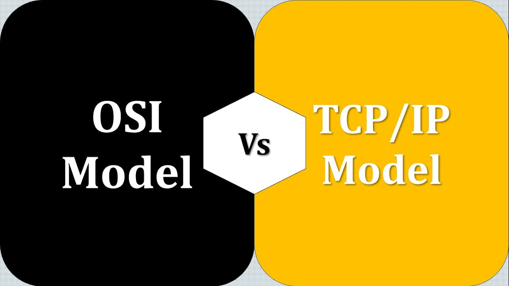
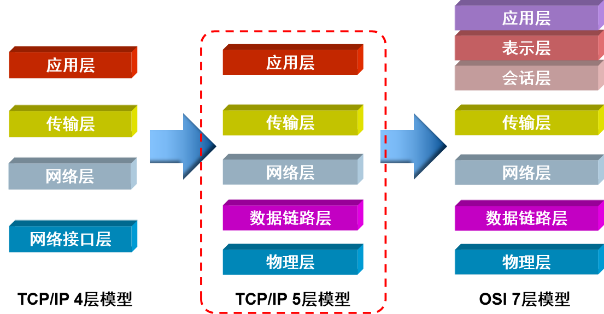
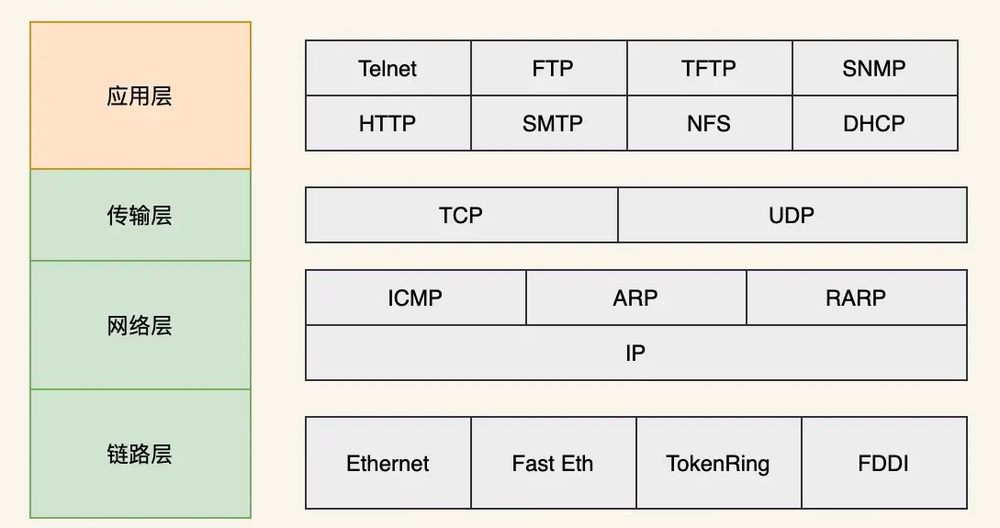

# TCP/IP模型

通过前面的模型，我们知道，OSI(Open Systems Interconnection Reference Model，开放系统互联基本参考模型)将网络分为了7层，每一层都有对应的职责，但是在实际应用中，我们听到的更多的是 “五层网络模型”，这又是为何呢？

其实，由国际化标准组织制定的 OSI 模型，本来是最应该在全球范围内推广的网络模型，不过因为 OSI 的设计过于理想不合实际，再加上当时应用 TCP/IP 模型的因特网（Internet）已经覆盖了全球大部分地区。种种原因，导致 OSI 并没有取得市场化的成功，仅仅是获得了理论上的研究成果。而 TCP/IP 模型则被作为了事实上的国际标准。

## TCP/IP模型

那什么是TCP/IP模型呢？

TCP/IP（Transmission Control Protocol/Internet Protocol，传输控制协议/因特网协议）四层网络模型，也有人愿意归为 “五层网络模型”。TCP/IP是一系列协议的集合，所以严格称呼应该是TCP/IP协议族，以其中最重要的TCP协议和IP协议命名。

最开始，TCP/IP模型将网络分为4层：应用层，传输层，网络层和网络接口层，对应于OSI7层模型来说，将应用层、表示层和会话层统一归纳为应用层，将数据链路层和物理层统一归纳为网络接口层。这种分层非常简单直接，而且容易定义和实施。但是太过于粗暴，比如网络接口层的定义就太过于粗放，不利于各大计算机网络厂商进行研发和应用，所以，介于OSI和TCP/IP模型中间的“五层网络模型”成为了大家比较熟知的网络分层模型。

“五层网络模型”下面的四层与OSI 7层模型的职责完全一致，仅仅是将应用层、表示层和会话层统一归纳为应用层，因为这三层统一是通过应用程序感知并处理的，和网络通信关系不大。

## TCP/IP 协议族

下面我们将简单介绍一下这些网络协议：

#### 数据链路层和物理层

在数据链路层和物理层上，TCP/IP并未定义任何特定协议，它支持所有标准的和专用的协议，例如广泛使用的以太网协议。

#### 网络层

网络层协议众多，但是最著名的还是IP协议，下面我们简单来介绍一下：
* IP协议：互联网协议，它定义了网络层地址。
* ICMP协议：网络控制消息协议，探测网络连接情况。
* ARP协议：地址解析协议，负责把IP地址解析为MAC地址。
* OSPF协议：开放式最短路径优先协议(路由协议)。

#### 传输层

传输层就两个协议：
* TCP协议：传输控制协议，面向连接的可靠协议，传输速度慢。
* UDP协议：用户数据报协议，面向非连接的不可靠的协议，传输速度快。

### 应用层

* HTTP：超文本传输协议，默认端口是80.
* FTP：文件传输协议，默认端口是20/21.
* TFTP：简单文件传输协议，端口为69.
* DHCP：动态主机配置协议，端口为67/68.