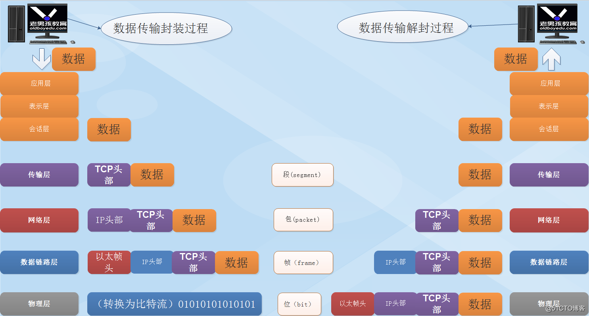
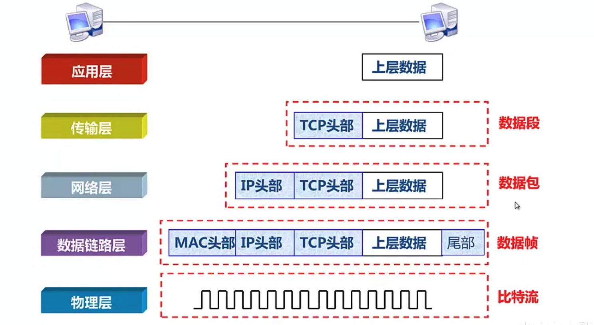
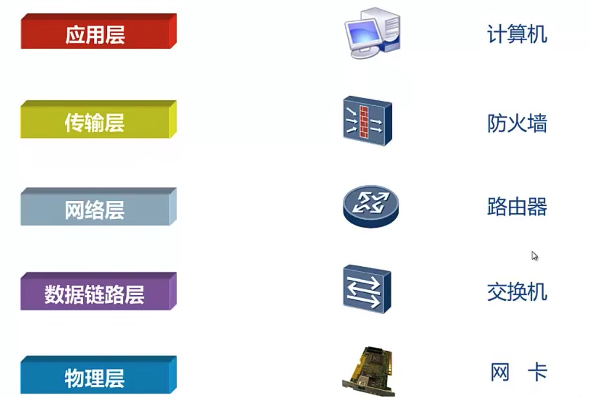

# TCP/IP模型

通过前面的模型，我们知道，OSI(Open Systems Interconnection Reference Model，开放系统互联基本参考模型)将网络分为了7层，每一层都有对应的职责，但是在实际应用中，我们听到的更多的是 “五层网络模型”，这又是为何呢？

其实，由国际化标准组织制定的 OSI 模型，本来是最应该在全球范围内推广的网络模型，不过因为 OSI 的设计过于理想不合实际，再加上当时应用 TCP/IP 模型的因特网（Internet）已经覆盖了全球大部分地区。种种原因，导致 OSI 并没有取得市场化的成功，仅仅是获得了理论上的研究成果。而 TCP/IP 模型则被作为了事实上的国际标准。

## TCP/IP模型

那什么是TCP/IP模型呢？

TCP/IP（Transmission Control Protocol/Internet Protocol，传输控制协议/因特网协议）四层网络模型，也有人愿意归为 “五层网络模型”。TCP/IP是一系列协议的集合，所以严格称呼应该是TCP/IP协议族，以其中最重要的TCP协议和IP协议命名。

最开始，TCP/IP模型将网络分为4层：应用层，传输层，网络层和网络接口层，对应于OSI7层模型来说，将应用层、表示层和会话层统一归纳为应用层，将数据链路层和物理层统一归纳为网络接口层。这种分层非常简单直接，而且容易定义和实施。但是太过于粗暴，比如网络接口层的定义就太过于粗放，不利于各大计算机网络厂商进行研发和应用，所以，介于OSI和TCP/IP模型中间的“五层网络模型”成为了大家比较熟知的网络分层模型。

“五层网络模型”下面的四层与OSI 7层模型的职责完全一致，仅仅是将应用层、表示层和会话层统一归纳为应用层，因为这三层统一是通过应用程序感知并处理的，和网络通信关系不大。

## TCP/IP 协议族

下面我们将简单介绍一下这些网络协议：

#### 数据链路层和物理层

在数据链路层和物理层上，TCP/IP并未定义任何特定协议，它支持所有标准的和专用的协议，例如广泛使用的以太网协议。

#### 网络层

网络层协议众多，但是最著名的还是IP协议，下面我们简单来介绍一下：
* IP协议：互联网协议，它定义了网络层地址。
* ICMP协议：网络控制消息协议，探测网络连接情况。
* ARP协议：地址解析协议，负责把IP地址解析为MAC地址。
* OSPF协议：开放式最短路径优先协议(路由协议)。

#### 传输层

传输层就两个协议：
* TCP协议：传输控制协议，面向连接的可靠协议，传输速度慢。
* UDP协议：用户数据报协议，面向非连接的不可靠的协议，传输速度快。

### 应用层

* HTTP：超文本传输协议，默认端口是80.
* FTP：文件传输协议，默认端口是20/21.
* TFTP：简单文件传输协议，端口为69.
* DHCP：动态主机配置协议，端口为67/68.

## 数据封装与解封装

前面，我们学习了网络模型，但是你知道数据是如何在网络模型中呈现的么？每一次是否是一致的？

下面我们就从这张数据流图来说起！

首先需要明确一个问题，发送方与接收方各层之间必须采用相同的协议才能建立连接、实现正常的通信，比如，应用层之间必须采用相同的编码解码规则オ能保证用户信息传输的正确性，传输层之间必须采用相同的踹ロ号与协议对应关系，才能保证上层应用进程间的通信，网络层之间必须采用相同的逻辑寻址过程才能保证数据不会传输到错误的目的地。如果数据链路层采用的协议不同，接收方甚至都不能“理解数据的内容，如果物理层的硬件接口规格不相同，接收方甚至连信号都无法接收到。

#### 数据封装

在网络中传输数据需要对其进行封装，也就是加入网络参考模型中各层对应的头部信息，这些头部信息的主要作用是用来帮助中间传输系统将数据传输到一个正确的目的地，它不是为了给接收方看的。数据的封装过程传输层的传输是端到端的，类似于我们将信封交到邮递员手上；数据链路层主要负责本地区域的传输，类似邮递员将信封交到邮局；而网络层的传输是点到点的，类似信封被邮局发出去在不同城市间传输；所有的数据要转换成物理信号比特流在物理层传输。

* 应用层：将数据封装在对应的应用层协议数据体中，添加应用层协议的协议头，如HTTP协议的请求头和请求体（数据通常封装在请求体）。
* 传输层：将应用层数据报封装在数据包的数据体中，添加传输层协议头，如TCP首部。
* 网络层：将传输层的数据报封装在网络层的数据体中，添加网络层协议头，如IP首部。
* 数据链路层：将网络层的数据报封装在数据链路层的数据体中，添加数据链路层协议头，如MAC地址等信息。
* 物理层：物理层负责将数字信号转换为电信号发送。

#### 数据解封装

而到接收方那边时，他不关心这个数据是如何发送过来的，对接收方来说数据才是最重要的所以要对数据进行解封装，将封装的一些头部都去掉与封装过程相反。

* 应用层：通过协议规范，将协议头和数据体拆分，数据从协议数据体中提取
* 传输层：将协议头和数据体拆分，根据协议头的信息来将数据体交给应用层来处理。
* 网络层：将协议头和数据体拆分，根据协议头的信息来将数据体交给传输层来处理。
* 数据链路层：将协议头和数据体拆分，根据协议头的信息来将数据体交给网络层来处理。
* 物理层：物理层负责将接收的电信号转换为数字信号。

#### 数据在各层中的称呼

为了区分数据在不同层的呈现形式，通过不同的称呼将其进行区分，下面是数据在解封装过程中各层级之间的称呼：

#### 不同层级对应的设备

由于数据在不同层级之间进行封装和解封是由不同的网络设备来处理的，下图是各层之间使用的网络设备：

