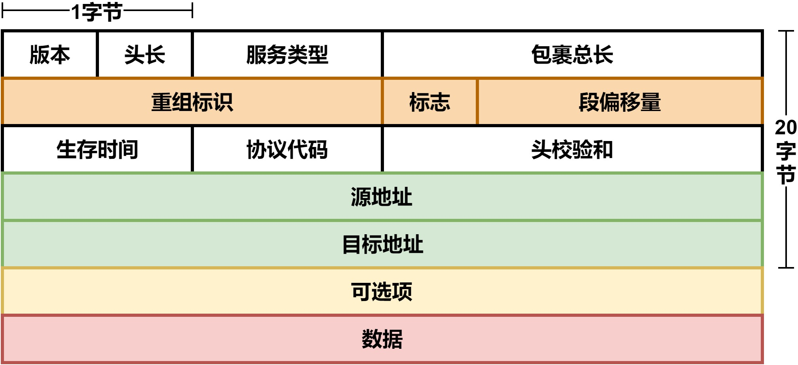
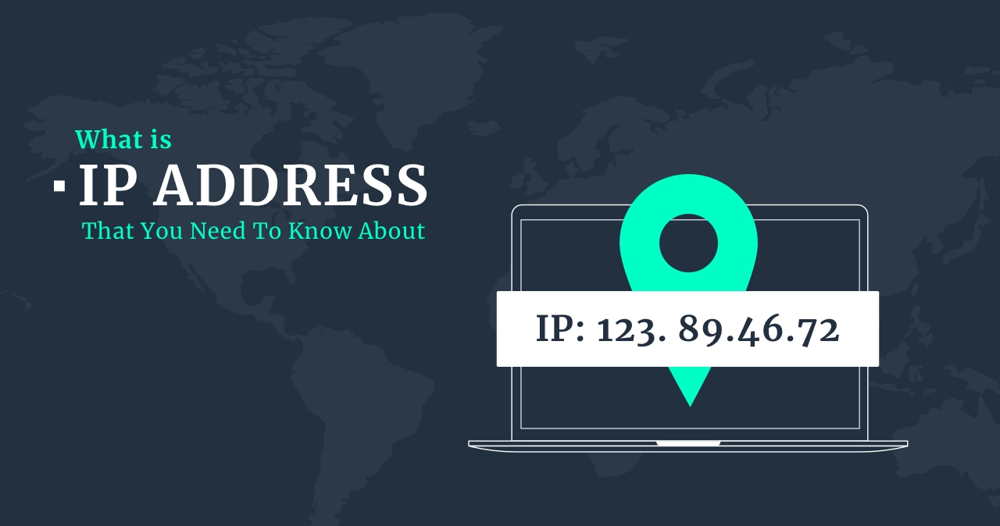
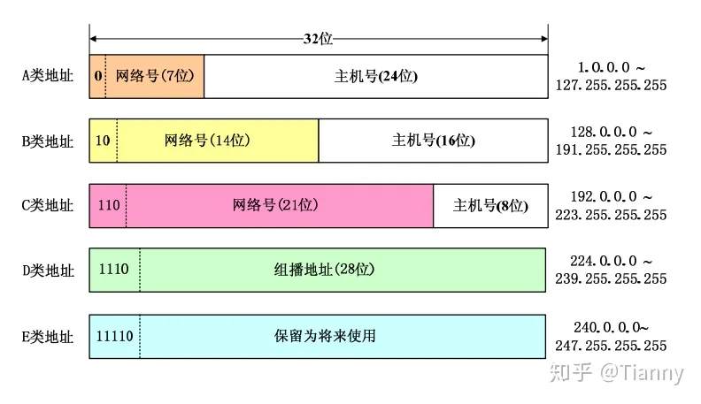

# IP协议

IP协议是为计算机网络相互连接进行通信而设计的协议。在因特网中，它是能使连接到网上的所有计算机网络实现相互通信的一套规则，规定了计算机在因特网上进行通信时应当遵守的规则。任何厂家生产的计算机系统，只要遵守IP协议就可以与因特网互连互通。

IP协议实际上是一套由软件程序组成的协议软件，它把各种不同“帧”统一转换成“IP数据报”格式，这种转换是因特网的一个最重要的特点，使所有各种计算机都能在因特网上实现互通，即具有“开放性”的特点。正是因为有了IP协议，因特网才得以迅速发展成为世界上最大的、开放的计算机通信网络。因此，IP协议也可以叫做“因特网协议”。

IP协议位于TCP-IP网络模型的第三层，主要的作用如下：

* 定义网络层设备的逻辑地址，俗称网络层地址，如IP地址。
* 在不同的网段之间选择最佳转发路径。

## IP数据包

IP数据包是在IP层中用于在互联网上进行数据传输的数据单元，它包含了发送和接收主机之间传输的信息。其基本格式如下：

IP的数据包的长度是可变的，它由两部分组成：首部和数据。首部由两部分组成，固定部分和可变部分；固定部分为20个字节，可变部分由一些选项组成，最长40个字节。

### IP数据包各字段含义如下：
* 版本（Version）：指定IP协议版本号，IPv4为4，IPv6为6。
* 头部长度（Internet Header Length，IHL）：指定IP数据包头部长度，以32位字（4字节）为单位，最小值为5，最大值为15。
* 服务类型（Type of Service，TOS）：用于指定IP数据包的服务质量，包括优先级、延迟、吞吐量和可靠性等。
* 总长度（Total Length）：指定整个IP数据包的长度，包括头部和数据部分。
* 标识（Identification）：每个IP数据包都有一个唯一的标识符，用于将分片的数据包重新组合成完整的数据包。
* 标志（Flags）：用于标识是否为分片数据包，以及分片数据包的片段情况。
* 片段偏移（Fragment Offset）：指定分片数据包的偏移量，以8字节为单位。
* 存活时间（Time to Live，TTL）：用于限制IP数据包在互联网上传输的跳数，每经过一个路由器TTL值会减1，当TTL值为0时，数据包将被丢弃。
* 协议（Protocol）：指定IP数据包的上层协议类型，如TCP、UDP、ICMP等。
* 头部校验和（Header Checksum）：用于检验IP数据包头部的完整性，保证数据传输的可靠性。
* 源地址（Source Address）：指定发送方的IP地址。
* 目标地址（Destination Address）：指定接收方的IP地址。
* 选项（Options）：可选字段，用于扩展IP数据包的功能，如路由跟踪、时间戳等。
* 负载（Payload）：指定IP数据包的数据部分，即需要传输的具体数据。

### IP数据包封装流程 

IP数据包封装（Encapsulation）是指在数据传输过程中，将上层协议的数据添加IP头部和尾部，将其转换为IP数据包，以便在互联网上传输。

IP数据包封装的流程如下：
1. 应用层将需要传输的数据发送给传输层（如TCP或UDP），并将目标主机的IP地址和端口号一并传递给传输层。
2. 传输层将数据分段（如果需要），并将每个数据段添加传输层头部和尾部，生成传输层数据包。
3. 网络层（IP层）将传输层的数据包添加IP头部和尾部，生成IP数据包。
4. 网络接口层将IP数据包转换为二进制数据，加上网络接口头部和尾部，生成帧。
5. 帧通过物理层的介质传输到目标主机。
6. 目标主机的网络接口层接收到帧，将其转换为二进制数据，并去掉网络接口头部和尾部，生成IP数据包。
7. 目标主机的网际层接收到IP数据包，去掉IP头部和尾部，得到传输层数据包。
8. 目标主机的传输层接收到传输层数据包，去掉传输层头部和尾部，得到应用层的数据。

以上是IP数据包封装的基本流程，不同的协议和网络环境可能会有所不同。需要注意的是，IP数据包的封装过程是逐层封装的，每一层都添加了自己的头部和尾部，以便在传输过程中进行数据传递和路由。

需要特别注意的是，在整个过程中，IP地址始终保持不变，但是MAC地址在经过不同网段时，就会发生变化，而经过相同网段时，不会发生变化。

## IP地址

***IP地址（Internet Protocol Address）是指互联网协议地址，又译为网际协议地址。***

***IP地址是IP协议提供的一种统一的地址格式，它为互联网上的每一个网络和每一台主机分配一个逻辑地址，以此来屏蔽物理地址的差异。***

所以，从上面的概念我们看得出，IP是一种互联网协议，是由网络动态分配的一个逻辑地址，类似于人的身份证号。

## IP地址
IP协议中还有一个非常重要的内容，那就是给因特网上的每台计算机和其它设备都规定了一个唯一的地址，叫做“IP地址”。由于有这种唯一的地址，才保证了用户在连网的计算机上操作时，能够高效而且方便地从千千万万台计算机中选出自己所需的对象来。

IP地址就像是我们的家庭住址一样，如果你要写信给一个人，你就要知道他（她）的地址，这样邮递员才能把信送到。计算机发送信息就好比是邮递员，它必须知道唯一的“家庭地址”才能不至于把信送错人家。只不过我们的地址是用文字来表示的，计算机的地址用二进制数字表示。

IP地址被用来给Internet上的电脑一个编号。大家日常见到的情况是每台联网的PC上都需要有IP地址，才能正常通信。我们可以把“个人计算机”比作“一台电话”，那么“IP地址”就相当于“电话号码”，而Internet中的路由器，就相当于电信局的“程控式交换机”。

#### IP地址的作用
1. 任何联网的设备，都必须拥有IP地址，否则无法上网。
2. 在网络中唯一的标识一个联网的设备。

### IP地址的结构
1. IP地址是一个32位的二进制数，通常被分割为4个“8位二进制数”（也就是4个字节）
2. IP地址通常用“点分十进制”表示成（a.b.c.d）的形式，其中，a,b,c,d都是0~255之间的十进制整数。
3. 由网络位和主机位构成，两部分相加为32bit。
4. 使用掩码来区分网络位和主机位，掩码的长度与IP地址的长度是相同的，同为32bit。
5. IP地址中，与掩码中的1对应的位为网络位，与掩码中的0对应的位为主机位。

例如：
* IP地址为100.4.5.6，实际上用二进制表示为：01100100.00000100.00000101.00000110
* 上面的IP的掩码如果是：255.255.255.0，二进制表示为：11111111.11111111.1111111.00000000，那么前三位就是网络位，最后一位是主机位。

### IP地址分类

通常，IP地址分为A，B，C，D，E五类，每一类都有不同的划分规则：

#### A类IP地址
一个A类IP地址是指，掩码是255.0.0.0，所以在IP地址的四段号码中，第一段号码为网络号码，剩下的三段号码为本地计算机的号码。如果用二进制表示IP地址的话，A类IP地址就由1字节的网络地址和3字节主机地址组成，网络地址的最高位必须是“0”。A类IP地址中网络的标识长度为8位，主机标识的长度为24位，A类网络地址数量较少，有126个网络，每个网络可以容纳主机数达1600多万台。
A类IP地址 地址范围1.0.0.1到127.255.255.254 [2]  （二进制表示为：00000001 00000000 00000000 00000001 - 01111111 11111111 11111111 11111110）。最后一个是广播地址。

#### B类IP地址
一个B类IP地址是指，掩码是255.255.0.0，在IP地址的四段号码中，前两段号码为网络号码。如果用二进制表示IP地址的话，B类IP地址就由2字节的网络地址和2字节主机地址组成，网络地址的最高位必须是“10”。B类IP地址中网络的标识长度为16位，主机标识的长度为16位，B类网络地址适用于中等规模的网络，有16384个网络，每个网络所能容纳的计算机数为6万多台。

B类IP地址地址范围128.0.0.1-191.255.255.254 [1]  （二进制表示为：10000000 00000000 00000000 00000001----10111111 11111111 11111111 11111110）。 最后一个是广播地址。

#### C类IP地址

一个C类IP地址是指，子网掩码为255.255.255.0，在IP地址的四段号码中，前三段号码为网络号码，剩下的一段号码为本地计算机的号码。如果用二进制表示IP地址的话，C类IP地址就由3字节的网络地址和1字节主机地址组成，网络地址的最高位必须是“110”。C类IP地址中网络的标识长度为24位，主机标识的长度为8位，C类网络地址数量较多，有209万余个网络。适用于小规模的局域网络，每个网络最多只能包含254台计算机。

C类IP地址范围192.0.0.1-223.255.255.254 [1]  （二进制表示为: 11000000 00000000 00000000 00000001 - 11011111 11111111 11111111 11111110）。

#### D类IP地址

D类IP地址在历史上被叫做多播地址(multicast address)，即组播地址。在以太网中，多播地址命名了一组应该在这个网络中应用接收到一个分组的站点。多播地址的最高位必须是“1110”，范围从224.0.0.0到239.255.255.255。

## IP地址的缺陷

目前，IP协议使用的版本是第四版，所有称之为IPV4，此版本的协议由于设计较早，没有很好的考虑到互联网如此蓬勃的发展，造成了两个主要扥问题：

### IP地址空间不足

IP地址是通过32Bit表示的，那么总位数为2的32次方，总共4294967296个，随着网络的发展，联网的设备逐渐增多，IP地址将会被快速消耗殆尽。各项资料显示全球IPv4位址可能在2005至2010年间全部发完（实际情况是在2019年11月25日IPv4位地址分配完毕）。

### IP地址的浪费问题

在一个网段内，如果实际使用的IP地址远远少于此网段的IP总容量，那么剩余的IP地址也不能被配置在其他网段的主机上，导致了同网段的空闲IP地址完全浪费掉。由于此浪费问题的存在，进一步导致了IP地址的空间不足。

### 解决方案

为了增加IP地址的重用性，减少IP地址的浪费，进而扩大IP地址的浪费率，可以将IP地址进行分类：公有地址和私有地址！

#### 公有地址

公有地址（Public address）由Inter NIC（Internet Network Information Center因特网信息中心）负责。这些IP地址分配给注册并向Inter NIC提出申请的组织机构。通过它直接访问因特网。

#### 私有地址

私有地址（Private address）属于非注册地址，专门为组织机构内部使用，是无法用来连接并上网的！

以下列出留用的内部私有地址
A类： 10.0.0.0--10.255.255.255
B类： 172.16.0.0--172.31.255.255
C类： 192.168.0.0--192.168.255.255

所以，通常情况下，在企业和家庭内部的网络中，设备使用的都是私有IP地址！

## 特殊IP地址

#### 网络地址

表示的是一个网络范围，仅仅表示一个区域，不代表任何一个主机/设备。主机位全部是0的IP地址为网络地址。

例如：IP地址为：192.168.1.0，掩码为255.255.255.0，就是一个网络地址。

#### 广播地址

表示的是一个网络范围内的所有主机或者设备，与网络地址相对，主机位置全是1的IP地址，就是广播地址。

例如：IP地址为：192.168.1.255，掩码为255.255.255.0，就是一个主机地址。

#### 可用地址

在任何一个网段内，除了网络地址和广播地址，都是可用的IP地址。此IP地址是可以在网络中唯一的标识一个主机/设备。

#### 其他
1. 127.0.0.0 ~ 127.255.255.255，称为回环地址，表示的是设备自身，通常使用回环地址是127.0.0.1.
2. 全1的IP地址，即255.255.255.255表示一个网段内所有主机/设备。
3. 全为0的IP地址，即0.0.0.0表示所有网段。
