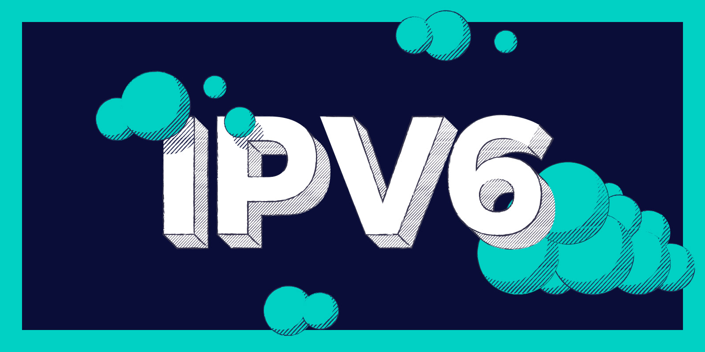
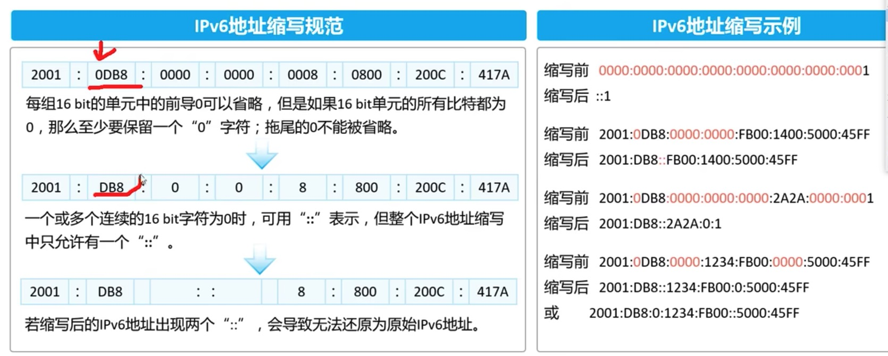

# IPV6 协议

我们知道，IPV4地址存在着较大的缺陷，比如：

1. 地址瓶颈：IPv4地址空间只有32位，最多只能表示42亿个IP地址，但由于互联网的迅速发展，这个地址空间很快被耗尽，IPv4地址资源短缺。
2. 安全性问题：IPv4协议的数据包是明文传输的，易受到网络攻击和黑客入侵。
3. 服务质量问题：IPv4协议中没有明确的服务质量(QoS)保障机制，无法实现对不同数据流的优先级和保障。
4. 路由表问题：IPv4协议的路由表随着网络规模的扩大而增长，导致路由器需要处理的路由表越来越大，降低了路由器的性能。
5. 无法满足多网段需求：IPv4协议的子网掩码难以支持多个网段的组合。

为了解决上面的问题，IPV6协议诞生了！

## IPV6协议基本概念

IPv6（Internet Protocol version 6）是互联网协议第六版的简称，是互联网标准化的下一代网络层协议，是IPv4的升级版。IPv6的主要目标是扩大地址空间、提高路由效率和安全性、简化协议、改善扩展性和可配置性等方面。

IPv6是下一代互联网协议，其最主要的特点是地址空间更大、头部更简洁、安全性更高、对QoS的支持更好等。

IPv6的使用场景主要包括以下几个方面：
* 未来互联网：随着IPv4地址的枯竭，IPv6成为未来互联网的发展方向，IPv6地址将足以支持所有的网络设备，从而满足未来互联网的需求。
* 移动互联网：随着移动设备的普及，IPv6可以为移动设备提供更大的地址空间和更好的QoS支持，从而提高移动互联网的性能和用户体验。
* 物联网：IPv6地址空间足够大，可以为物联网中的所有设备提供唯一的IP地址，从而方便管理和维护。
* 安全性：IPv6支持IPSec协议，能够提供更高的安全性，保护网络数据的机密性、完整性和可用性。

总之，IPv6是未来互联网的发展方向，可以为各种应用场景提供更好的性能、安全性和可靠性。

### IPV6地址表示方式

IPv6地址长度是128位，比IPv4地址长度多了96位，使得IPv6的地址空间更大，IPv6总地址空间理论上可以达到340,282,366,920,938,463,463,374,607,431,768,211,456个，这个数量足以使得地球上每一粒啥子都有一个IP地址。IPv6地址的格式以8组16进制数表示，每组16进制数用冒号隔开。

可以用多种方式来表示，其中最常用的有以下三种：
* 冒分十六进制表示法：将128位地址分成8组，每组16位，用冒号隔开，每组用4位十六进制数表示，例如：2001:0db8:85a3:0000:0000:8a2e:0370:7334。
* 压缩表示法：在冒分十六进制表示法中，如果一组地址中所有的数都是0，则可以用一个双冒号(::)表示，例如：2001:0db8:85a3::8a2e:0370:7334。如果有多组地址中都是0，则只能使用一次双冒号表示，例如：fe80::1。
* IPv4-mapped IPv6 address：IPv6地址中的后32位可以用来表示IPv4地址，这种地址表示方式可以用来进行IPv4和IPv6的互通，例如：::ffff:192.0.2.1 表示IPv4地址192.0.2.1对应的IPv6地址。

#### IPV6 子网掩码

IPv6采用了前缀长度表示子网掩码，其表示方式为在IPv6地址后面加上“/”和子网掩码位数，如“2001:0db8:85a3:0000:0000:8a2e:0370:7334/64”，表示该IPv6地址使用了64位作为网络部分，剩余的位数作为主机部分。与IPv4不同，IPv6地址中的子网掩码没有固定的位数，而是根据地址类型、网络规模等因素灵活变化的。

#### IPV6地址分类

IPv6没有地址分类的概念，与IPv4不同，IPv6地址由128位组成，采用冒号十六进制分隔符分为8组，每组由4个十六进制数字表示。IPv6地址的分配通常是按照前缀长度进行，可以根据前缀长度的不同将IPv6地址分为以下三种类型：
* 单播地址（Unicast Address）：用于唯一标识一个节点或接口，分为全球单播地址和站点本地单播地址。
* 组播地址（Multicast Address）：用于一次传输数据到多个节点或接口，分为全球组播地址和站点本地组播地址。
* 任播地址（Anycast Address）：用于标识一组节点中的任意一个节点，数据传输将到达最近的任意一个节点，分为全球任播地址和站点本地任播地址。

由于IPv6地址空间的巨大，因此分配地址时不需要像IPv4那样进行地址分类，直接分配地址前缀即可。

## 与IPV4的对比

当今互联网使用的IP地址有两个版本：IPv4和IPv6。IPv4是早期的IP地址版本，而IPv6是更现代化的版本。这两个版本之间的区别主要在以下几个方面：

1. 地址长度：IPv4使用32位地址，而IPv6使用128位地址。这意味着IPv6具有比IPv4更多的地址空间，可以支持更多的设备连接到互联网。
2. 地址格式：IPv4地址是由四个十进制数（每个数的取值范围是0到255）组成，用点号分隔。而IPv6地址是由八组16位的十六进制数组成，用冒号分隔。IPv6还允许使用双冒号简写连续的0。
3. 安全性：IPv6具有比IPv4更好的安全性。IPv6支持IPSec，这是一种网络安全协议，可以提供数据的机密性、完整性和认证。而IPv4不支持IPSec，需要额外的安全措施来确保网络安全。
4. 性能：IPv6可以提供比IPv4更好的网络性能和速度，因为IPv6地址可以在路由器上进行路由选择，从而减少了网络流量的传输时间。IPv6还可以提供更好的多播功能。

总体来说，IPv6是比IPv4更现代化和功能更强大的IP地址版本，可以更好地满足当前和未来互联网的需求。