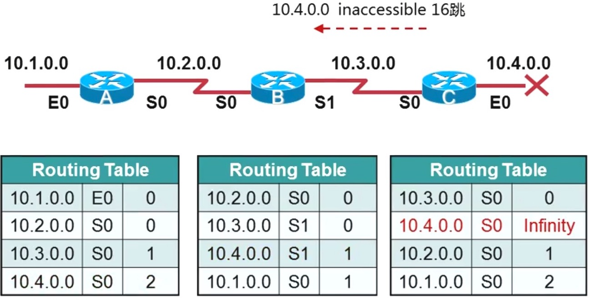

# 路由器

在任何一种网络中，路由器是一种非常重要的计算机网络设备，用于在网络中传输数据包，并根据目的地址将数据包从一个网络转发到另一个网络。路由器通常被用于连接不同的网络，并使它们能够相互通信。

所以，当我们需要将不同的网络连接在一起时，就需要使用路由器。

那么路由器能给我们的网络提供那些价值呢？

## 路由器的价值

1. 实现网络互连：路由器能够将不同网络之间的数据包进行转发和交换，从而实现不同网络之间的互连，使得用户可以在不同网络之间自由传输数据。
2. 提供网络安全：路由器可以通过设置安全策略、过滤规则等方式来保护网络安全，防止网络攻击和恶意访问。
3. 支持带宽管理：路由器可以实现带宽控制和流量管理，确保网络资源的合理利用，从而提高网络的效率和性能。
4. 支持负载均衡：路由器可以根据网络流量和负载情况，将数据包平均分配到不同的路径和链路上，从而实现负载均衡，提高网络的可靠性和稳定性。
5. 支持VPN和远程访问：路由器可以通过VPN和远程访问等技术，实现用户在远程地区对本地网络的访问，方便远程办公和数据共享。
6. 支持多种网络协议：路由器支持多种网络协议，如TCP/IP、IPX/SPX等，可以在不同的网络环境下进行数据传输和通信。

那么，路由器有哪些常用的概念呢？

## 路由器的基本概念

1. IP地址：路由器使用IP地址来标识网络和设备，并根据IP地址对数据包进行转发。
2. 路由表：路由器维护一个路由表，其中记录了网络地址、子网掩码、网关和接口之间的映射关系。当一个数据包到达路由器时，路由器会查找路由表来确定数据包的最终目的地，并将其转发到相应的接口。
3. 接口：路由器有多个接口，每个接口都连接到一个网络或子网，用于接收和发送数据包。
4. NAT：网络地址转换（NAT）是一种路由器功能，它可以将内部网络使用的私有IP地址映射到外部网络使用的公共IP地址上，以实现与外部网络的通信。

## 路由器的分类

1. 家庭路由器：用于在家庭网络中连接多个设备，通常具有简单的管理界面和较少的网络功能。
2. 企业路由器：用于连接企业内部网络和外部网络，具有复杂的路由和安全功能，如VPN（Virtual Private Network）和防火墙。
3. 边缘路由器：用于连接ISP（Internet Service Provider）网络和企业网络，通常具有高速连接和可靠性，以及强大的QoS（Quality of Service）和路由功能。
4. 核心路由器：用于连接ISP网络中的主干网络，具有高性能、高可用性和高度可扩展性的特点，用于处理大量的数据包转发和路由计算。

每个路由器都维护者一个路由表，这是路由器工作的核心和转发数据包的关键，下面我们就来介绍一下路由表的基本概念。

## 路由表

路由表是一张存储在路由器中的表格，它记录了路由器所知道的网络拓扑结构、网络地址和路由信息等重要的信息。路由表的作用是帮助路由器进行数据包转发和路由选择，从而实现网络的互连和数据传输。

### 路由表的价值在于：
1. 支持路由选择：路由表中存储了网络的路由信息，能够根据数据包的目的地址和网络拓扑结构，选择最佳的路由路径进行转发和传输。
2. 提高网络效率：路由表可以根据网络负载和流量情况，自动调整路由路径和带宽分配，从而提高网络的效率和性能。
3. 实现网络优化：路由表可以通过配置路由信息、优化路由策略等方式，实现网络的优化和调整，从而满足不同用户的需求。
4. 提高网络可靠性：路由表可以通过配置备用路由和冗余链路等方式，提高网络的可靠性和稳定性，保证网络的正常运行。

### 工作原理

路由表的工作原理是基于路由选择算法和路由表的匹配机制实现的。当一个数据包到达路由器时，路由器会首先根据数据包的目的地址，在路由表中查找与之匹配的路由信息，然后选择最佳的路由路径进行转发和传输。

路由表中的每一条路由信息包括目的网络地址、子网掩码、下一跳地址、出接口等关键信息，通过匹配这些信息，路由器能够准确地确定数据包的下一跳地址和路由路径，从而实现数据包的转发和传输。

### 路由表的分类

路由表可以根据不同的分类标准进行分类，以下是一些常见的分类方式：

1. **静态路由表和动态路由表**：根据路由信息的来源，路由表可以分为静态路由表和动态路由表。静态路由表是手工配置的，路由信息不会随着网络拓扑结构的变化而自动更新，因此需要手动进行维护和更新。动态路由表则是由路由协议自动计算和维护的，路由信息会随着网络拓扑结构的变化而自动更新。
2. **默认路由表和完整路由表**：根据路由信息的详细程度，路由表可以分为默认路由表和完整路由表。默认路由表只包含默认路由信息，即将所有未知目的地址的数据包转发到默认网关。完整路由表则包含了网络中所有的路由信息，可以进行更加精确的路由选择和转发。
3. **内部路由表和外部路由表**：根据路由器所处的位置，路由表可以分为内部路由表和外部路由表。内部路由表是存储在路由器内部，用于选择内部网络中的路由路径；外部路由表则是存储在边界路由器上，用于选择不同网络之间的路由路径。
4. **本地路由表和远程路由表**：根据路由表中存储的路由信息所涉及的网络范围，路由表可以分为本地路由表和远程路由表。本地路由表中存储的是路由器所直接连接的网络信息，远程路由表则是存储其他网络中的路由信息。
5. **IPv4路由表和IPv6路由表**：根据路由表所适用的协议类型，路由表可以分为IPv4路由表和IPv6路由表。IPv4路由表适用于IPv4网络，IPv6路由表适用于IPv6网络。