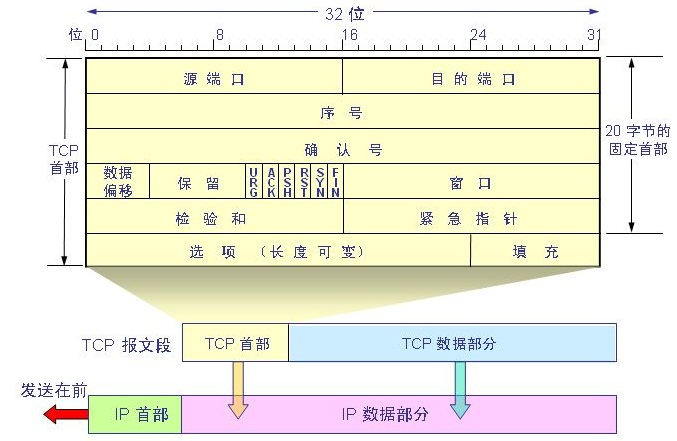

# TCP协议与UDP协议

在TCP/IP模型的第四层是传输层，而传输层主要提供端到端的连接，可以认为是进程与进程之间的通信，这其中最重要的两个通信协议是TCP和UDP协议，通常在面试中还是实际应用中使用非常广泛，那么今天我们就来详细了解他们。

## TCP协议

TCP（Transmission Control Protocol）传输控制协议，是一种面向连接的、可靠的传输层协议。它通过在通信双方建立可靠的连接来保证数据的可靠传输。

### TCP协议的主要特点包括：
1. 面向连接：在数据传输之前，通信双方需要先建立可靠的连接，然后才能进行数据传输。数据传输完成后，需要释放连接。
2. 可靠性：TCP协议通过使用序号、确认号、校验和、重传等机制来保证数据的可靠传输，能够检测和恢复因传输错误而导致的数据丢失和损坏。
3. 流量控制：TCP协议通过使用滑动窗口机制来控制数据的发送和接收速率，避免发送方发送过多的数据导致接收方无法处理。
4. 拥塞控制：TCP协议通过使用拥塞窗口机制来控制网络中的拥塞情况，避免网络拥塞导致数据丢失和传输延迟。

### TCP协议的主要优势包括：
1. 可靠性：TCP协议能够确保数据的可靠传输，避免数据丢失和损坏。
2. 顺序性：TCP协议能够保证数据的顺序传输，避免数据出现乱序。
3. 流量控制：TCP协议能够通过滑动窗口机制来控制数据的发送和接收速率，避免发送方发送过多的数据导致接收方无法处理。
4. 拥塞控制：TCP协议能够通过拥塞窗口机制来控制网络中的拥塞情况，避免网络拥塞导致数据丢失和传输延迟。

### TCP报文结构

下面我是TCP报文结构的解释：
1. 源端口号（Source Port）：占16位，表示发送端的端口号。
2. 目的端口号（Destination Port）：占16位，表示接收端的端口号。
3. 序号（Sequence Number）：占32位，表示本报文段的第一个数据字节的编号。
4. 确认号（Acknowledgment Number）：占32位，表示期望收到对方下一个报文段的第一个数据字节的编号。
5. 数据偏移量（Data Offset）：占4位，表示TCP报文头部的长度，以4字节为单位。
6. 保留（Reserved）：占6位，保留未用。
7. 紧急URG（Urgent）：占1位，为1表示URG字段有效。
8. 确认ACK（Acknowledgment）：占1位，为1表示ACK字段有效。
9. 推送PSH（Push）：占1位，为1表示PSH字段有效。
10. 复位RST（Reset）：占1位，为1表示RST字段有效。
11. 同步SYN（Synchronize）：占1位，为1表示SYN字段有效。
12. 终止FIN（Finish）：占1位，为1表示FIN字段有效。
13. 窗口大小（Window）：占16位，表示对方可接收的最大数据量。
14. 校验和（Checksum）：占16位，对TCP报文头和数据段进行CRC校验的结果。
15. 紧急指针（Urgent Pointer）：占16位，仅当URG标志为1时该字段才有意义，表示在数据流中紧急数据的结束位置。
16. 选项（Options）：长度不定，最多可达40字节，用于支持TCP选项。

### TCP三次握手

由于TCP提供的是一种全双工的通信服务，即数据可以在同一时间内进行双向传输，那么TCP三次握手是指在建立TCP连接时，需要客户端和服务器端共进行3次数据包交互的过程：

其过程如下：
1. 第一次握手：客户端发送SYN包（同步包）给服务器端，SYN包包含了客户端的初始化序列号ISN（Initial Sequence Number）。
2. 第二次握手：服务器端收到SYN包后，发送ACK包（确认包）和SYN包给客户端，ACK包中确认序列号（Acknowledgment Number）为客户端的ISN+1，同时也包含服务器端的初始化序列号ISN。
3. 第三次握手：客户端收到服务器端的SYN和ACK包后，再次发送ACK包给服务器端，确认序列号为服务器端的ISN+1，此时TCP连接建立成功，可以开始数据传输。

其实，第一步和第二步完成的是客户端和服务端的单方通信通道的简历，第二步和第三步完成的是服务端和客户端的单方通信通道的建立，完成这三步，才能够完成客户端和服务端的双向通信通道的建立。

以上三次握手的过程可以简化为SYN、SYN+ACK、ACK这三个步骤。这个过程是为了确保客户端和服务器端的通信是可靠的，防止因为网络等原因导致的数据包丢失或重复发送而引起的问题。

### TCP四次挥手

TCP四次挥手是指在关闭TCP连接时，需要客户端和服务器端关闭双向通信，需要共进行4次数据包交互的过程。

其过程如下：
1. 第一次挥手：客户端发送FIN包（结束包）给服务器端，表示客户端已经没有数据要发送了，但是仍然可以接受来自服务器端的数据。
2. 第二次挥手：服务器端收到FIN包后，发送ACK包给客户端，确认已经收到客户端的FIN包，并且仍有数据要发送。
3. 第三次挥手：服务器端发送FIN包给客户端，表示服务器端已经没有数据要发送了。
4. 第四次挥手：客户端收到服务器端的FIN包后，发送ACK包给服务器端，确认已经收到服务器端的FIN包，此时TCP连接关闭。

以上四次挥手的过程可以简化为FIN、ACK、FIN、ACK这四个步骤。这个过程是为了确保客户端和服务器端的数据都已经发送完毕，防止数据包丢失或重复发送而引起的问题。

## UDP协议

UDP（User Datagram Protocol，用户数据报协议）是一种面向无连接的传输协议，它不像TCP协议那样建立可靠的连接，而是直接将数据报发送出去。UDP协议主要用于对传输速度要求较高，但数据完整性要求不高的应用场景，如音频、视频等实时传输领域。

***UDP协议的优势在于它不需要建立连接，没有连接维护的开销，也没有流量控制和拥塞控制的机制，因此能够更快速地传输数据，且数据包头部开销较小。***

UDP协议的报文结构相对简单，包含以下几个字段：
1. 源端口号（Source Port）：发送端口的标识。
2. 目的端口号（Destination Port）：接收端口的标识。
3. 长度（Length）：UDP数据报的长度，包括UDP报头和UDP数据部分的总长度。
4. 校验和（Checksum）：用于检测UDP数据报在传输过程中是否出错，如果出错就会被丢弃。但是，UDP协议只提供了简单的检验和，不能保证数据的完整性和正确性。

UDP协议的简单和高效使得它在很多场景中都得到了广泛的应用，如网络游戏、实时视频、VoIP（Voice over Internet Protocol）等。