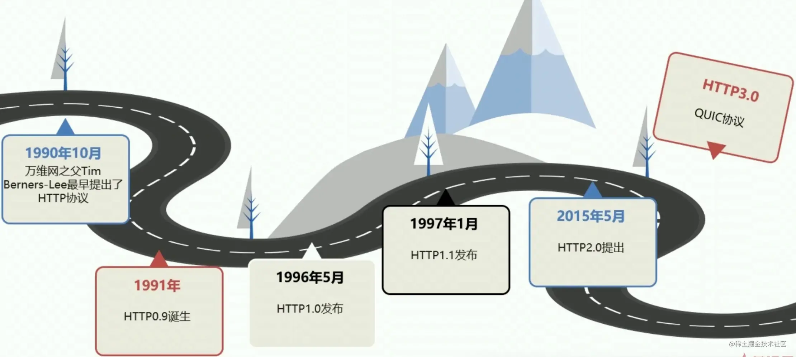
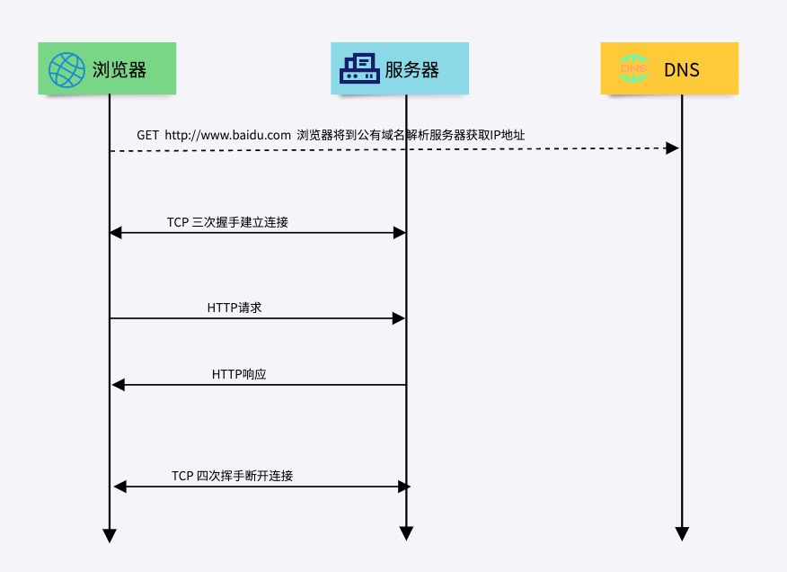
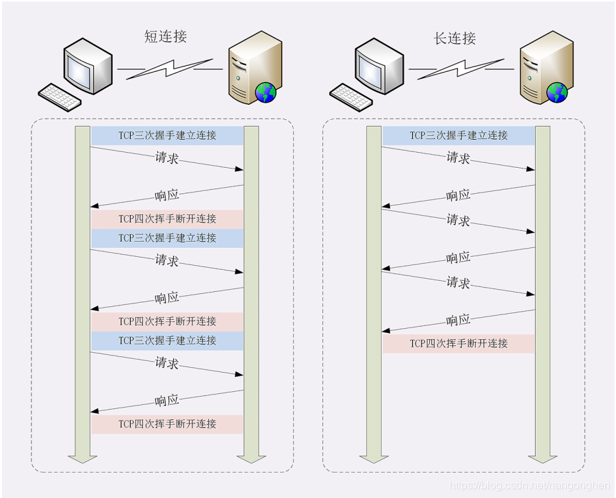

# HTTP 协议

作为一个软件研发者，HTTP协议的重要性就不言而喻了，HTTP协议是应用层非常重要的协议，所以我们今天就来了解一下!

HTTP（Hypertext Transfer Protocol，超文本传输协议）是一种应用层协议，它用于在Web浏览器和Web服务器之间传递超文本文档或其他资源。HTTP协议是基于TCP协议来传输数据的，它采用客户端-服务端（Client-Server）模式，客户端向服务器发送请求，服务器返回响应。

HTTP协议的优势在于它是一种无状态协议，即每个请求都是独立的，服务器不会保存任何关于客户端的信息，这样可以提高服务器的处理效率。同时，HTTP协议具有简单、灵活的特点，易于实现和扩展。

## HTTP协议的前世今生

从上图可以看出，HTTP的主要发展经历了如下的阶段

1. HTTP/0.9：该版本于1991年发布，只支持GET方法，没有头部信息，只能传输HTML文本。该版本只用于在服务器和客户端之间传输超文本文本。
2. HTTP/1.0：该版本于1996年发布，支持多种HTTP方法，包括GET、POST、PUT、DELETE等，同时引入了头部信息，可以传输多种数据类型。HTTP/1.0的特点是每个请求/响应只能包含一条命令，不能并行处理请求。此版本还引入了状态码。
3. HTTP/1.1：该版本于1999年发布，支持持久连接和流水线处理，并引入了缓存机制、分块传输编码等特性，大大提高了HTTP的性能。此版本还引入了Host头部，以支持虚拟主机技术。到目前为止，此版本仍旧在互联中应用广泛。
4. HTTP/2：该版本于2015年发布，引入了多路复用、二进制分帧等技术，可实现一个TCP连接上处理多个请求和响应，并大幅度提高了HTTP的性能和安全性。
5. HTTP/3：该版本于2020年发布，使用了新的传输协议QUIC，能够提供更快的连接建立速度、更低的延迟和更好的拥塞控制，以及更好的安全性。

## HTTP报文结构

HTTP协议的报文结构包括两个部分：请求报文和响应报文。

### 请求报文

请求报文包括请求行、请求头和请求体。

请求行包括请求方法、URI和HTTP版本，如：`GET /index.html HTTP/1.1`。

#### 请求方法

HTTP请求方法指的是客户端向服务器发送请求时所使用的不同方法或动作，常用的HTTP请求方法有以下几种：
1. **GET**：获取资源，常用于向服务器请求指定资源的内容，如网页、图片、视频等。使用GET方法请求时，请求参数会在URL中传递，因此可以被缓存、收藏和分享等。在RESTful API中，GET是获取服务器资源。
2. **POST**：提交数据，常用于向服务器提交表单数据、上传文件等。使用POST方法提交的数据会在请求正文中传递，因此适合传递大量数据。在RESTful API中，POST是创建新的资源。
3. **PUT***：上传资源，常用于向服务器上传指定资源的内容，如文本、图片、视频等。使用PUT方法上传资源时，需要指定上传资源的URL。在RESTful API中，PUT是修改服务器的资源。
4. **DELETE**：删除资源，常用于向服务器请求删除指定的资源。使用DELETE方法请求时，需要指定要删除的资源的URL。
5. **HEAD**：获取资源头信息，与GET方法类似，但只返回HTTP响应头信息，不返回响应正文。
6. **OPTIONS**：获取服务器支持的HTTP方法，常用于向服务器请求查看指定资源所支持的HTTP请求方法。
7. **TRACE**：回显服务器收到的请求，常用于调试和诊断网络连接问题，一般情况下不会使用。

这些HTTP请求方法都有不同的意义和用途，可以根据具体需求选择合适的方法来发送请求。

#### 请求头

HTTP协议中请求头字段是客户端在发送HTTP请求时，在请求头部分添加的字段，常用的请求头字段包括：
1. Host：指定请求的主机名和端口号，用于在同一个IP地址下区分不同的网站。
2. User-Agent：指定客户端使用的浏览器类型和版本，以便服务器返回适合客户端浏览器的内容。
3. Accept：指定客户端可接收的响应类型，例如text/html、image/jpeg等。
4. Accept-Language：指定客户端接收响应的语言类型，例如en-US、zh-CN等。
5. Accept-Encoding：指定客户端可接受的压缩类型，例如gzip、deflate等。
6. Referer：指定请求的来源页面，通常用于记录访问日志或统计分析等。
7. Cookie：指定客户端保存的cookie信息，用于维护会话状态。
8. Authorization：指定客户端使用的认证信息，用于访问需要授权的资源。
9. If-Modified-Since：指定客户端上一次请求资源的修改时间，服务器可以根据修改时间判断资源是否需要重新返回给客户端。

这些请求头字段可以帮助客户端向服务器传递更多的信息，以便服务器能够更好地理解客户端的请求，并返回合适的响应结果。

### 响应报文

响应报文包括状态行、响应头和响应体。

状态行包括HTTP版本、状态码和状态描述，如：`HTTP/1.1 200 OK`.

#### HTTP响应状态码

HTTP响应报文中的状态码是指服务器返回的响应结果状态的标识，常用的状态码及其代表的意义如下：

1. **1xx（信息性状态码）**：表示请求已经被服务器接收，但是还需要进一步处理。
    * 100 Continue：服务器已经接收到请求头部，并且客户端应该继续发送请求体。
    * 101 Switching Protocols：服务器已经理解了客户端的请求，并将通过 Upgrade 头部通知客户端采用不同的协议来完成这个请求。
2. **2xx（成功状态码）**：表示请求已经成功被服务器接收、理解、并处理。
    * 200 OK：请求成功。
    * 201 Created：请求已经被实现，新的资源已经被创建。
    * 204 No Content：请求已经成功处理，但是没有返回任何响应内容。
3。 **3xx（重定向状态码）**：表示客户端需要采取进一步的动作才能完成请求。
    * 301 Moved Permanently：请求的资源已被永久移动到新的 URI。
    * 302 Found：请求的资源临时从不同的 URI 响应请求。
    * 304 Not Modified：表示客户端请求的资源未被修改，可以使用本地缓存的版本。
4. **4xx（客户端错误状态码）**：表示客户端提交的请求有错误或者不完整。
    * 400 Bad Request：客户端请求的语法错误。
    * 401 Unauthorized：请求需要用户认证，但用户没有进行认证或者认证失败。
    * 403 Forbidden：请求被服务器拒绝。
    * 404 Not Found：请求的资源不存在。
5. **5xx（服务器错误状态码）**：表示服务器无法完成对请求的处理。
    * 500 Internal Server Error：服务器在处理请求的过程中发生了错误。
    * 502 Bad Gateway：服务器作为网关或者代理，从上游服务器收到的响应无效。
    * 503 Service Unavailable：服务器暂时无法处理请求，通常是由于维护或过载造成的。

这些状态码可以让客户端了解服务器处理请求时的情况，客户端可以根据不同的状态码采取相应的措施，例如重试、重定向或者修改请求等。

## HTTP协议通信过程

HTTP协议的通信过程一般包括以下几个步骤：
1. 域名解析：浏览器先从URL中解析出域名，并以此检查缓(浏览器缓存和本地域名解析文件)存中有没有对应的IP，如果没有，则向共有的DNS服务器发起请求获取IP。
2. 建立TCP连接：HTTP使用TCP作为其传输层协议，所以在开始HTTP通信之前需要先建立TCP连接。
3. 发送HTTP请求：客户端向服务器发送HTTP请求，请求包括请求行、请求头和请求正文等部分。
4. 服务器响应：服务器收到请求后，会根据请求的内容生成相应的HTTP响应报文，并将其发送给客户端。
5. 客户端接收响应：客户端接收到HTTP响应报文后，会根据状态码等信息进行相应的处理，并解析响应报文中的内容。
6. 关闭TCP连接：HTTP使用短连接的方式，即每次请求和响应都会建立和关闭一个TCP连接，所以在完成通信后需要关闭TCP连接。

## HTTP长连接与短连接

HTTP的长连接和短连接都是指在HTTP通信过程中使用的TCP连接的保持方式，具体区别如下：
1. **短连接**：每次HTTP请求都会建立一个TCP连接，并在请求完成后立即关闭连接。这种方式下，客户端和服务器端每次通信都需要重新建立连接，对服务器资源的消耗较大，但对于客户端而言，可以更及时地获取服务器端的数据，适用于对实时性要求较高的场景。
2. **长连接**：在一个TCP连接上，可以进行多次HTTP请求和响应，不需要每次请求和响应都建立新的TCP连接。这种方式下，客户端和服务器端的通信效率较高，减少了建立和关闭连接的消耗，适用于对性能要求较高的场景。服务端可以设置Connection：Keep-Alive，以及指定长连接的最长时间。

需要注意的是，长连接也有可能因为网络中的其他因素而被关闭，例如超时等，因此在使用长连接时需要注意及时检查连接状态。

在实际应用中，可以根据场景的需要选择合适的连接方式。对于需要实时获取数据的场景，可以使用短连接；而对于需要频繁通信且对性能要求较高的场景，可以使用长连接来减少连接的建立和关闭的消耗。