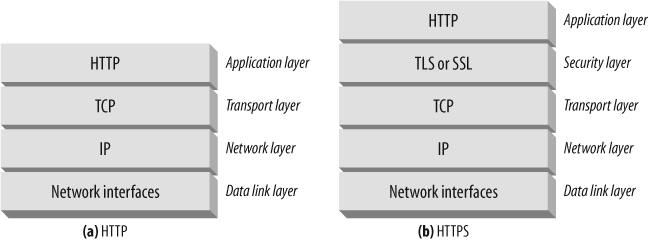

# HTTPS 协议

由于HTTP协议在传输过程中天生具有“明文”的特点，使得在整个传输过程中非常容易被劫持，所以它的数据具有不可信的特点。为了解决这个问题，在HTTP的基础上，诞生了HTTPS协议。

HTTPS（Hypertext Transfer Protocol Secure）是在HTTP上添加了安全套接字层（SSL/TLS协议）的协议，用于在计算机网络上进行安全通信。它是一种加密传输协议，通过使用SSL/TLS协议建立起安全通道，确保数据传输过程中的机密性和完整性，以及防止数据被篡改和窃取。

HTTPS的诞生主要是为了解决HTTP协议在传输过程中存在的安全隐患，比如数据的加密、完整性校验和身份认证等问题。它在性能、安全和可信度等方面比HTTP更加优秀。

与HTTP相比，HTTPS最大的区别在于传输数据时使用SSL/TLS加密，这使得HTTPS更加安全。同时，HTTPS还可以通过数字证书对服务器进行身份验证，防止中间人攻击。由于数据的加密和身份认证需要消耗计算资源，因此HTTPS的性能可能略低于HTTP，但是HTTPS仍然是现代互联网上最常用的协议之一。

## HTTPS的价值优势包括：
1. 数据加密：使用SSL/TLS协议对传输数据进行加密，确保数据的机密性和完整性，防止数据被篡改和窃取。
2. 身份认证：通过数字证书对服务器进行身份验证，防止中间人攻击。
3. 信任度高：HTTPS使用数字证书对网站进行认证，用户可以通过数字证书判断网站的可信度。
4. 搜索引擎优化：HTTPS是谷歌搜索引擎的加分项，使用HTTPS协议可以提升网站的搜索排名。

## SSL/TLS协议

SSL（Secure Sockets Layer）和TLS（Transport Layer Security）协议是用于保证网络通信安全的协议。SSL是TLS的前身，两者基本上是一样的，但TLS更为安全，更加健壮。

SSL/TLS主流的版本有SSLv2、SSLv3、TLSv1.0、TLSv1.1、TLSv1.2和TLSv1.3。SSLv2已经被废弃，SSLv3存在安全问题，TLSv1.0、TLSv1.1也被认为不够安全，目前主流的版本是TLSv1.2和TLSv1.3，它们采用更强的加密算法和更严格的安全机制。

### 混合加密算法

SSL/TLS协议的基本概念是通过使用非对称加密算法进行密钥交换，然后使用对称加密算法进行通信加密。非对称加密算法包括RSA和Diffie-Hellman算法，对称加密算法包括AES、DES、3DES等。

SSL/TLS协议使用非对称加密算法进行秘钥交换是为了解决密钥分配的问题。传统的对称加密算法需要在通信前将密钥传递给通信双方，但这种传输很容易被窃听和篡改，从而导致密钥泄露。非对称加密算法可以解决这个问题，通信双方可以通过公钥和私钥的方式进行密钥交换，而且公钥是可以公开的，不会像传输密钥那样容易被窃听和篡改。

SSL/TLS协议使用对称加密算法进行通信加密和解密是为了保证通信的高效性。对称加密算法加密和解密速度快，适合大量数据的加密和解密，而且可以使用硬件加速器来提高效率。在通信过程中，使用非对称加密算法进行密钥交换，然后使用对称加密算法进行通信加密和解密，既保证了安全性，又保证了通信效率。

综上所述，SSL/TLS协议使用非对称加密算法进行秘钥交换和对称加密算法进行通信加密和解密，是为了在安全性和通信效率之间取得平衡。

## 通信过程

HTTPS的通信过程可以简单概括为以下几步：
1. 客户端向服务器发送HTTPS请求：客户端首先会向服务器发送HTTPS请求，请求中会包含一些必要的信息，如请求的URL等。
2. 服务器返回证书：服务器在接收到客户端的HTTPS请求后，会向客户端返回一个数字证书，证书中包含了服务器公钥等信息。
3. 客户端验证证书：客户端在接收到服务器返回的数字证书后，会使用预装的证书颁发机构（CA）根证书验证服务器的数字证书的有效性。
4. 客户端生成随机密钥：如果证书有效，客户端会生成一个随机的对称密钥，用于加密后续的通信内容。
5. 客户端使用服务器公钥加密对称密钥：客户端使用服务器公钥对随机生成的对称密钥进行加密，并将加密后的对称密钥发送给服务器。
5. 服务器使用私钥解密对称密钥：服务器使用自己的私钥对客户端发送过来的加密后的对称密钥进行解密，得到原始的对称密钥。
6. 服务器和客户端使用对称密钥进行通信加密和解密：一旦双方都拥有了相同的对称密钥，后续的通信内容就可以使用对称密钥进行加密和解密了。

总之，HTTPS的通信过程主要是通过非对称加密算法来保证通信安全，通过对称加密算法来提高通信效率。

## CA证书

CA证书是用于保护HTTPS通信的安全协议SSL/TLS中的一种数字证书，它用于验证服务器的身份和加密通信。下面是CA证书的申请、颁发和验证过程：

1. 申请CA证书：服务器管理员需要向受信任的CA机构提交证书签发请求（CSR），该请求包括服务器的公钥和一些与服务器有关的身份信息。
2. 颁发CA证书：CA机构会对服务器提交的CSR进行验证，并生成包含服务器公钥、身份信息以及CA机构的签名的证书，然后将该证书签发给服务器。
3. 证书验证：当客户端请求与服务器建立HTTPS连接时，服务器会将其证书发送给客户端。客户端接收到证书后，会使用CA机构的公钥验证证书是否合法，如果合法，客户端就可以安全地与服务器进行通信。

在证书验证过程中，客户端使用的CA机构公钥已经预置在操作系统或浏览器中，因此客户端无需再次获取CA机构的公钥。如果证书验证不通过，客户端会发出警告并停止通信，因为可能存在中间人攻击或服务器伪装等安全威胁。

需要注意的是，CA证书的有效期限制了其可用性，如果证书已过期，浏览器会发出警告并禁止访问。此外，CA证书也可以被吊销，如果证书被吊销，浏览器也会发出警告并禁止访问。